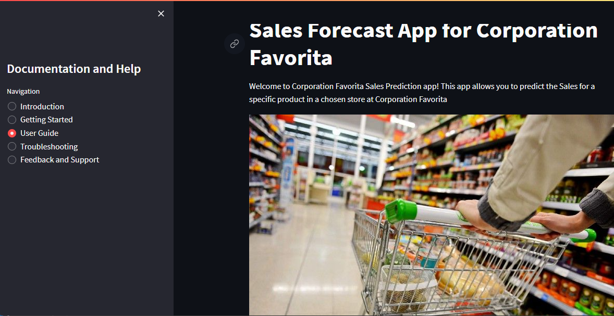

# Streamlit Sales Prediction App

# Article 
<a target="_blank" href="https://github-readme-medium-recent-article.vercel.app/medium/@@newtonkimathi20/1"> 


# Description
The "SalesForecastApp" is a user-friendly Streamlit web application designed to forecast store sales for thousands of products across different Favorita store locations. This app leverages powerful machine learning models to accurately predict product demand, enabling optimized inventory management and improved operational efficiency for Corporation Favorita, a leading Ecuadorian-based grocery retailer.
The SalesForecastApp empowers inventory managers, supply chain managers, and store managers to make data-driven decisions, optimize inventory levels, and meet customer demand effectively. With accurate demand forecasting and insightful visualizations, Corporation Favorita gains a competitive edge, increases customer satisfaction, and maximizes sales revenue.

## Recap
 This project was part of a comprehensive data analysis and machine learning project, where various steps such as data cleaning, data exploration, hypothesis testing, feature engineering, and model evaluation were performed to build robust forecasting models. The app showcases the final model and its predictions, making it a valuable tool for data-driven decision-making in the retail domain.

 # App Interface
 

 # Setup
You need Python3 on your system to setup this app. Then you can clone this repo and being at the repo's root :: streamlit sales prediction app> ... follow the steps below:
* Windows
```python
    python -m venv venv; venv\Scripts\activate; python -m pip install -q --upgrade pip; python -m pip install -qr requirements.txt 
`````` 
* Linux & MacOs
```python
    python3 -m venv venv; source venv/bin/activate; python -m pip install -q --upgrade pip; python -m pip install -qr requirements.txt  

``````
 
# Getting Started
To begin using the Sales Prediction App, follow these steps:

Clone the Repository:
``````
https://github.com/Newton23-nk/Sales-Prediction-App.git
``````
# Install Dependencies:
Install the required Python packages using the following command:
``````
pip install -r requirements.txt

``````
# Run the App:
Launch the app using Streamlit:
``````
streamlit run app.py

``````

# User Guide
The app requires the following input parameters for generating sales predictions:

* Date: Select the date for which the sales prediction is needed.
* On Promotion: Choose whether the product is on promotion (1 for Yes, 0 for No).
* Number of Transactions: Enter the number of transactions for the product.
* Oil Price (dcoilwtico): Input the oil price for the selected date.
* Product Category: Choose the product category from the available options.
* State: Select the state where the store is located.
* City: Choose the city where the store is situated.
* Weekly Sales Day: Enter the day of the week for which the sales occurred (0 for Sunday, 1 for Monday, ..., 6 for Saturday).


# Pretrained Model and Analysis
To better understand the modeling and analysis behind the app, you can explore the Analysis and Modeling directory [here](https://github.com/Newton23-nk/Time-Series-Analysis). It contains detailed information about the data preprocessing, feature engineering, model training, and evaluation that contributed to the creation of the app's predictive capabilities.

# Feedback and Support

Email: newtonkimathi20@gmail.com
GitHub Issues: Feel free to create an issue in the [GitHub repository]().
Connect with us on LinkedIn: 

# Author
Newton Kimathi